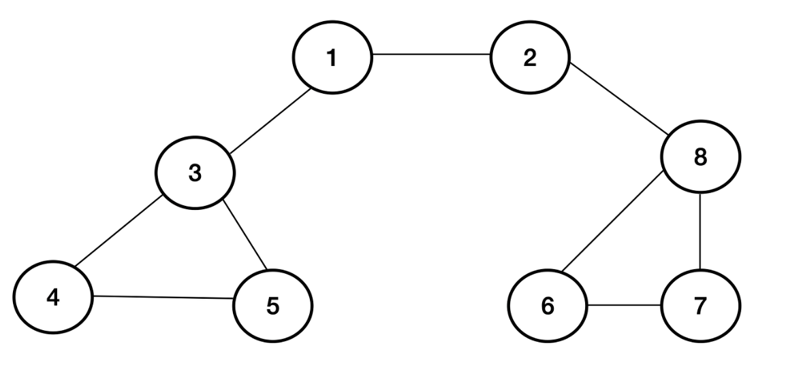

##### 알고리즘 Day3

## DFS

- DFS란
  - DFS(Depth First Search, 깊이 우선 탐색)는 그래프 전체를 탐색하는 방법 중에 하나로, 하나의 노드에 도착하면 그 노드에 연결되어 있는 노드의 가장 깊은 부분까지 들어간 후에 다른 노드를 탐색하는 방법.
  [DFS 설명 사이트](https://heytech.tistory.com/55)

  - 코드 특징
    - 재귀 함수 사용
    - 양방향 연결 
    : 만약에 1과 4,1과 5가 연결되어 있다면 노드 1에 갔을 때 4와 5에 연결되는 것 뿐 아니라, 4와 5에 갔을 때도 1에 연결이 됨. (문제를 보고 단방향 연결인지, 양방향 연결인지 구분하기)