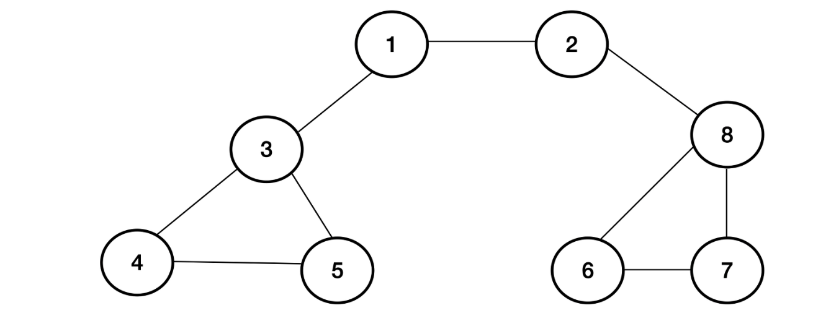

##### 알고리즘 Day4

## BFS

- BFS란
  - BFS(Breadth-First Search, 너비 우선 탐색)는 그래프에서 인접한 시작 노드에 인접한 노드부터 탐색하는 알고리즘이다. BFS는 최단거리를 구하거나, 미로 문제를 풀 때, 많이 사용된다. 

  
  https://heytech.tistory.com/56

  - DFS와 차이점 - 노드의 방문 순서! 
  -  Queue에 입력된 후에야 진짜 노드 방문!