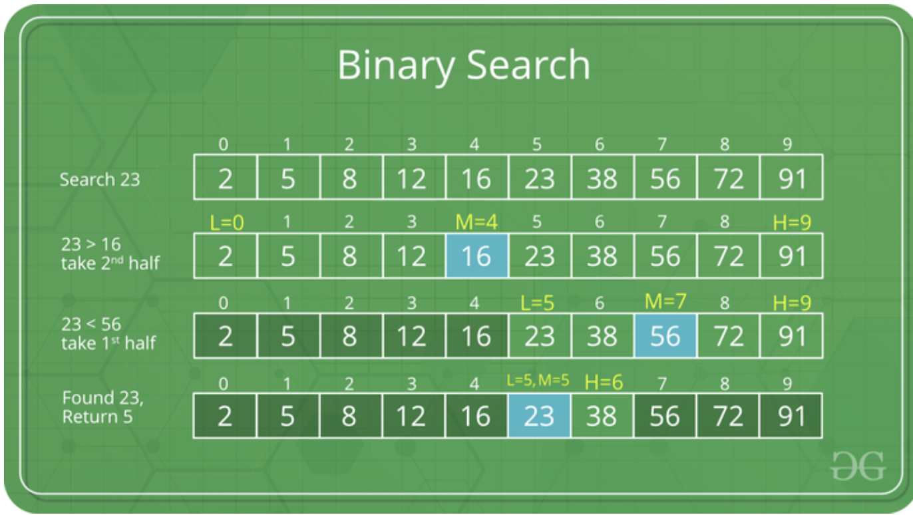

##### 알고리즘 DAY4

# Sort & Binary Search 

#### 1) Sort 
- sort 함수란, 어떤 배열을 내림차순, 또는 올림차순으로 정렬해주는 함수이다. 
- 구현 코드 
```cpp
#include <iostream>
#include <algorithm>
#include <vector>
#define SIZE 10 

using namespace std;

int main (void){
    ios:: sync_with_stdio (false) ; cin.tie(0);
    int arr[SIZE] = {1,3,5,2,7,8,4,10,9,6};
    vector <int> V ;

    cout << "10개의 입력을 부탁드립니다." << '\n';
    for (int i=0,k;i<SIZE;i++){
        cin >> k;
        V.push_back(k);
    }

    sort (arr,arr+SIZE);//0부터 SIZE까지 정렬
    sort(V.begin() , V.end()); // ,greater<int>() 추가 - 내림차순

    for (int i=0;i<SIZE;i++) cout << arr[i] << ' ' ;
    cout << '\n';
    for (int i=0;i<V.size();i++) cout << V[i] << ' ';

    cout << '\n';
    return 0;
}
```

위의 코드를 보며, sort함수에 대해 생각을 해보자면, 
(1)
sort 함수를 이용하기 위해서는 먼저 헤더 파일에 
```
#include <algorithm>
```
이 있어야 한다.
(2)
위의 함수에서는 array를 이용한 정렬, vector을 이용한 정렬을 나와있어 array와 vector를 사용할 때 sort 함수를 쓸 수 있다는 것을 확인할 수 있다. 
(3)
배열 array에서 sort 함수를 사용할 때 작성된 sort (arr, arr+10)의 뜻은 배열 array를 arr[0]부터 arr[10]까지 오름차순으로 정렬하라는 의미이다. 이 때, 위와 같이 sort의 parameter이 2개인 경우, default는 오름차순으로 정렬되는데, 이를 내림차순으로 바꾸기 위해서는 sort (arr, arr+10, greater<int>)로 변경해주면 된다. 
(4) 
vector V에서 sort 함수를 사용하는 경우에는 sort (V.begin(), V.end())를 작성하여서 V에서 V.begin() 즉 ,vector의 처음부터 vector가 끝날 때 까지 원소들을 정렬하는 것을 의미한다. vector 정렬의 default값도 오름차수능로, 내림차순으로 바꾸는 방식도 배열에서의 방식과 같다.

- sort를 커스텀한 코드

```cpp
#include<iostream>
#include<algorithm>
#include<vector>

using namespace std;

typedef struct Person{
    int height;
    int weight;
    int age;
}PERSON;

bool compare (const PERSON &a, const PERSON &b){
    if (a.height > b.height) return true;
    else if (a.height==b.height){
        if (a.weight > b.weight) return true;
        else if (a.weight == b.weight){
            return a.age > b.age;
        }
        else {
            return false;
        }
        } else {
            return false;
        }
    }


int main(void){
    ios:: sync_with_stdio(false); cin.tie(0);

    vector <PERSON> V;

    V.push_back({170,61, 17});
    V.push_back({128,36, 19});
    V.push_back({182,82, 21});
    V.push_back({152,35, 18});
    V.push_back({201,91, 25});
    V.push_back({182,72, 25});

    sort (V.begin(), V.end(),compare);
    
    for (int i=0;i<V.size();i++) cout << V[i].height << ' ' << V[i].weight << ' ' << V[i].age << '\n';
}
```

위 코드는 vector 안에 있는 요소가 하나가 아니라 두 개 이상일 경우의 정렬을 나타내는데, 위 경우는 신장, 체중, 나이를 받아들이고 신장 순서대로 정렬하되, 만약 신장이 같을 경우에는 체중 순서로 정렬, 그리고 체중 순서까지 같을 경우에는 나이의 순서로 정렬하는 코드를 구현했다.

#### 2) Binary_Search

-Binary_Search란, 데이터가 정렬되어 있을 때, 원하는 데이터를 제일 효과적으로 찾기 위한 방법이다. binary_search라는 이름에서 나타났듯이, 데이터를 반으로 나눠, 범위를 1/2해나가며 데이터를 찾는다. 

이를 이해하기 위해서 그림을 보면!

