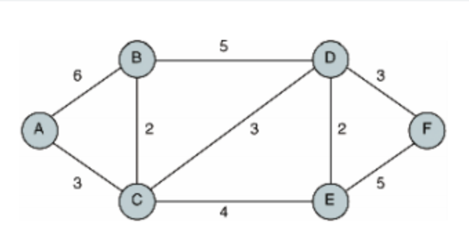

##### 알고리즘 DAY 7

## priority_queue 

- priority queue란
    - 넣은 순서를 기준으로 데이터가 나가는 구조인 일반적인 queue와 달리, 들어온 데이터의 값을 기준으로 데이터가 나오는 순서가 정해지는 구조이다.
    - priority queue를 작성할 때는 default 값은 내림차순으로, 큰 값이 앞에 위치한다. <br>
    만약, 작은 값을 앞에 두고 싶으면 정의할 때
    ```
        priority_queue <int, vector<int>, greater<int> > pq_small; // 오름 차순
    ```
    으로 하면 된다.
    - queue에서는 값을 볼 때 q.front()를 사용했지만. priority queue에서는 pq.top()을 사용한다.  

## dijkstra 

- dijkstra란
    - 하나의 시작 정점으로부터 모든 다른 정점 까지의 최단 경로를 찾는 기법이다.
    - 음수 가중치는 사용할 수 없다. 
    
    

  - dijkstra.cpp 코드에서 
  ```
  pq.push({-DIST[next_node], next_node});
   ```
   부분에 DIST[next_node]에 - 가 붙는 이유는 최단경로를 구하기 위해서, 제일 앞에 제일 작은 값이 오게 하기 위해서이다. (-를 안붙이면 제일 앞에 제일 큰 값)
   그래서, 이 값과 관련하여 curr_weight를 정의할 때도
   ```
   int curr_weight = -pq.top().first ;
   ```
   이처럼 정의되었다. 


[dijkstra 설명 글](https://velog.io/@717lumos/%EC%95%8C%EA%B3%A0%EB%A6%AC%EC%A6%98-%EB%8B%A4%EC%9D%B5%EC%8A%A4%ED%8A%B8%EB%9D%BCDijkstra-%EC%95%8C%EA%B3%A0%EB%A6%AC%EC%A6%98)