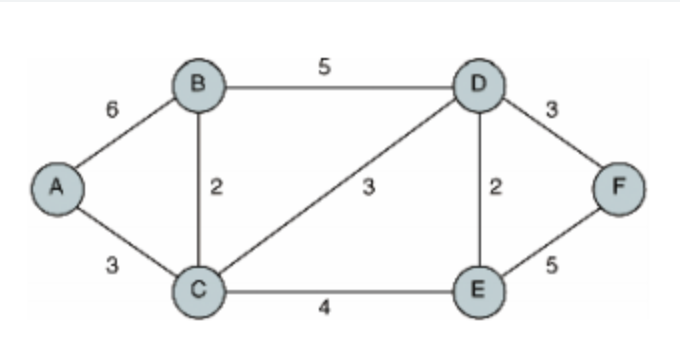

##### 알고리즘 DAY 7

## priority_queue 

- priority queue란
    - 넣은 순서를 기준으로 데이터가 나가는 구조인 일반적인 queue와 달리, 들어온 데이터의 값을 기준으로 데이터가 나오는 순서가 정해지는 구조이다.
    - priority queue를 작성할 때는 default 값은 내림차순으로, 큰 값이 앞에 위치한다. <br>
    만약, 작은 값을 앞에 두고 싶으면 정의할 때
    ```
        priority_queue <int, vector<int>, greater<int> > pq_small; // 오름 차순
    ```
    으로 하면 된다.
    - queue에서는 값을 볼 때 q.front()를 사용했지만. priority queue에서는 pq.top()을 사용한다.  

## dijikstra 

- dijikstra란
    - 하나의 시작 정점으로부터 모든 다른 정점 까지의 최단 경로를 찾는 기법이다.
    - 음수 가중치는 사용할 수 없다. 
    
    
- dijikstra 함수 구현
```cpp
#include <iostream>
#include <vector>
#include <queue>
#include <climits>
#define INF INT_MAX

/*
5 6
1
start end weight
5     1   1
1     2   2
1     3   3
2     3   4
2     4   5
3     4   6
*/

using namespace std ;

int V, E, start; 
int DIST[20010];
vector <pair <int, int > > graph[20010] ;

void dijkstra(){
    //Distance 무한대 값
    for (int i = 1 ; i<= V ; i++){
        DIST[i]=INF; // 다 못가는 상태로 초기화
    }
    priority_queue <pair <int, int > > pq;
    //priority_queue <pair <pair <int, int>, vector <int, int > > , greater <pair <int, int > > > ppq ; -> 이걸 사용하면 아래에서 -를 사용하지 않아도 됨. but, 시간 오래 걸림
    pq.push({0, start}); // weight , curr_node
    DIST[start] = 0 ; //왜냐하면, start에서 시작하기 때문에, start에서 start까지의 DIST는 0.

    // pq <0, start>
    while (!pq.empty()) {
        int curr_weight = -pq.top().first ; //0
        int curr_node = pq.top().second ; // start

        pq.pop();
        //pq: empty

        for (int i = 0 ; i <graph[curr_node].size() ; i++){
            int next_node = graph[curr_node][i].first; // end 
            int next_weight = graph[curr_node][i].second ; // weight

            if (DIST[next_node] > curr_weight + next_weight){
                DIST[next_node] = curr_weight + next_weight;
                pq.push({-DIST[next_node], next_node});
            }
        }
    }
    for (int i = 1 ; i <= V; i++){
        if (DIST[i] == INF) cout << "INF" << '\n';
        else cout << DIST[i] << '\n';
    }
    cout << '\n';
}
int main(void){
    ios::sync_with_stdio(false);cin.tie(0);
    cin >> V >> E ; // V: 정점의 개수, E: 간선의 개수
    cin >> start ; // start: 시작 정점의 번호
    for (int i = 0, a,b,c; i < E ; i++){
        cin >> a >> b >> c ;
        //start, end, weight
        graph[a].push_back({b,c});

    }
    // graph
    /*
        1 -> {2,2}(graph[1][0]) -> {3,3}(graph[1][1])
        2 -> {3,4} -> {4,5}
        3 -> {4,6} 
        4 -> 
        5 -> {4,1}
    */
    dijkstra();
    return 0;
}
```
  - 위 코드에서 
  ```
  pq.push({-DIST[next_node], next_node});
   ```
   부분에 DIST[next_node]에 - 가 붙는 이유는 최단경로를 구하기 위해서, 제일 앞에 제일 작은 값이 오게 하기 위해서이다. (-를 안붙이면 제일 앞에 제일 큰 값)
   그래서, 이 값과 관련하여 curr_weight를 정의할 때도
   ```
   int curr_weight = -pq.top().first ;
   ```
   위와 같이 정의되었다. 


[dijikstra 설명 글](https://velog.io/@717lumos/%EC%95%8C%EA%B3%A0%EB%A6%AC%EC%A6%98-%EB%8B%A4%EC%9D%B5%EC%8A%A4%ED%8A%B8%EB%9D%BCDijkstra-%EC%95%8C%EA%B3%A0%EB%A6%AC%EC%A6%98)